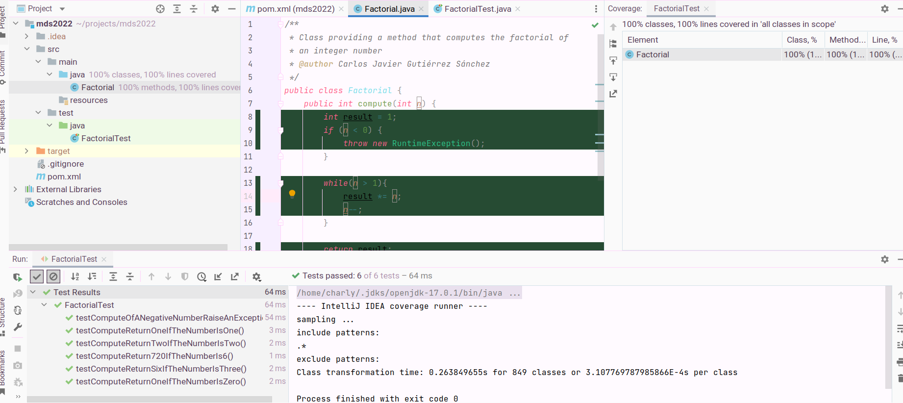

# mds-assignment1
Assignment 1 for the course software maintanance

Coverage:


Git commit tree:

```
*   98085b1 (origin/main, main) Merge branch 'develop'
|\  
| * 7028a43 (HEAD -> develop, origin/develop) add coverage image
* | 2758f5f Merge pull request #1 from Charly6596/develop
|\| 
| * ff9a62e add test cases comment
|/  
* fb364ca convert factorial to iterative
* 36863a3 clean factorial after each test
* d8b3f9f implement more tests and factorial
* a678c9c add test file
* 745e10b first commit
```
